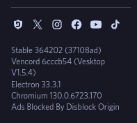

# Disblock Origin

A configurable ad-blocking "theme" for Discord that hides all Nitro and "boost" upsells,
alongside some annoyances.

> [!NOTE]  
> I kindly request that, while welcome, forks are kept in free forges such as Codeberg. Though it is not within my control, I do not wish for my projects to be hosted on GitHub. For more info, see: [Give Up Github!](https://giveupgithub.org)

## Installation

### With a client mod

Use your favorite client mod (such as Vencord) to add the theme. You can use
this URL, which mirrors the files on the repo:

```
https://raw.codeberg.page/AllPurposeMat/Disblock-Origin/DisblockOrigin.theme.css
```

### With Stylus

If using Discord from the browser, you can use the
[Stylus](https://add0n.com/stylus.html) to load and configure Disblock Origin.
First, click the button below with the extension installed:

[](https://codeberg.org/AllPurposeMat/Disblock-Origin/raw/branch/master/DisblockOrigin.user.css)

If on Firefox, you must enable `Patch CSP to allow style assets` or the style
won't work. If you are having problems, make sure
`Circumvent CSP 'style-src' via adoptedStyleSheets` is **DIS**abled (see
[#41](https://codeberg.org/AllPurposeMat/Disblock-Origin/issues/41) for
discussion).

### Checking

To see whether Disblock Origin is properly installed, check for the logo at the
bottom of the settings sidebar next to Discord's social logos, you should see a
Disblock Origin logo to let you know it's working.



## Customization

Certain features of Disblock Origin are cutomizable by overriding settings
listed at the top of the theme file:
https://codeberg.org/AllPurposeMat/Disblock-Origin/src/commit/2d5de9a365e0eceb4981c4cd3b06ad8d9e17dd8c/DisblockOrigin.theme.css#L9-L38

The UserCSS provides a UI for these, but it is unfortunately not possible to use
it via a client mod. Instead, to change a setting, copy and paste the `:root`
block into your custom CSS (accessible on Vencord via **Local Themes** > **Edit
QuickCSS**), and add any variables you want changed. Use `none` to hide
something, and `unset` to show it.

For example, to show the GIF button in the chat box, you can use the following
snippet in your custom CSS:

```css
:root {
  /* show the GIF picker button */
  --display-gif-button: unset;
}
```

The `display-nitro-features` setting is intended for Nitro users who want access to useful features such as:
- The Billing tab in user settings
- The toggle for Super Reactions
- Choosing a GIF as Avatar / Banner
